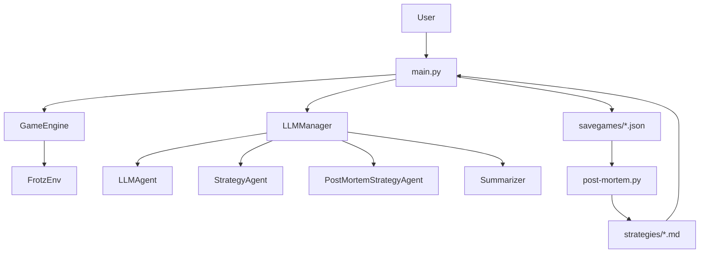
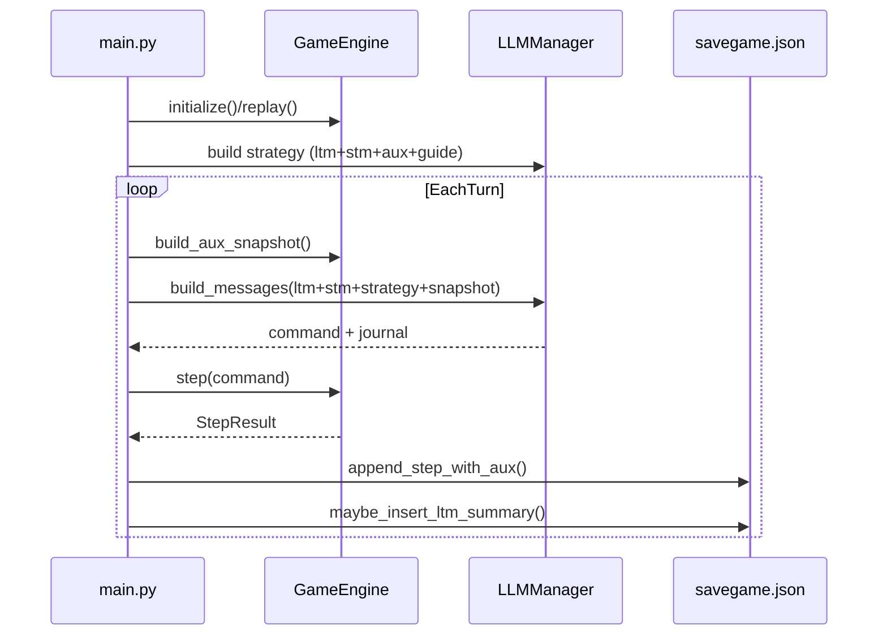
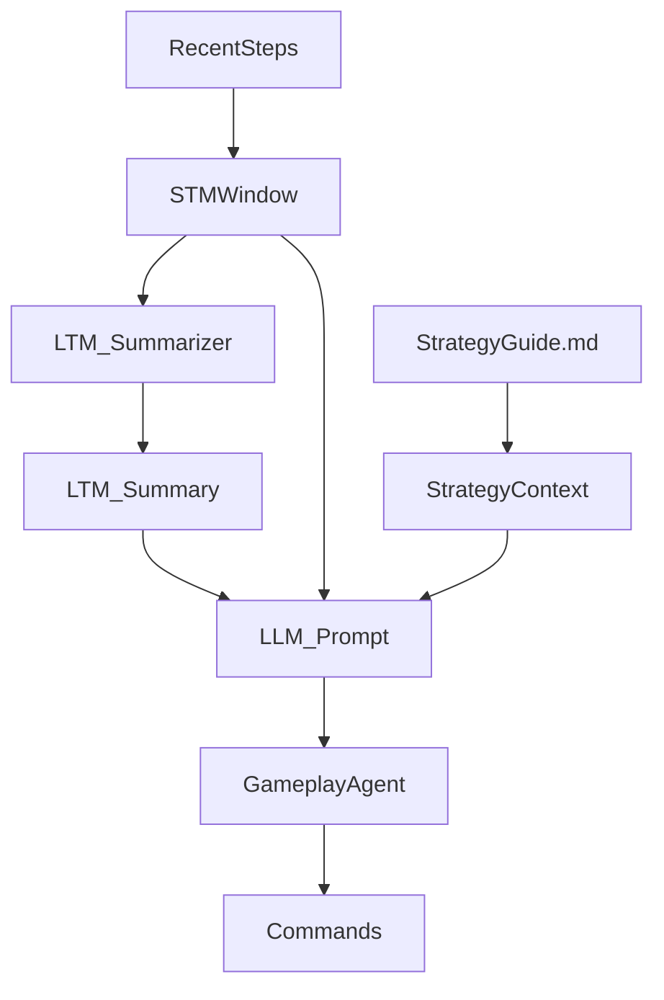
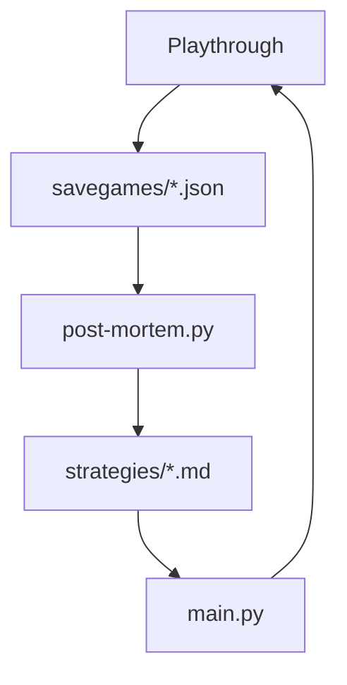

# Architecture and Features

This document explains how the scripts work together to play Z-machine games with an LLM, record rich logs, and learn better strategies over time. The focus is `main.py` and `post-mortem.py`, with supporting modules referenced where they shape behavior.

## Overview

The system orchestrates a Z-machine interpreter (Jericho/Frotz), multiple LLM roles, and an append-only savegame log. During play, the LLM proposes commands, the game engine executes them, and the system records observations plus auxiliary context (inventory, environment, time). As complete play-through sessions accumulate, a post-mortem process synthesizes a persistent strategy guide that is fed back into future runs to improve exploration and reduce repeated mistakes.

## System Architecture

- **Runtime controller**: `main.py` coordinates initialization, mode switching, strategy refresh, logging, and the main loop.
- **Engine wrapper**: `src/engine.py` encapsulates Jericho/Frotz state management, auxiliary snapshots, and repeat-action detection.
- **LLM orchestration**: `src/llm.py` defines four roles (gameplay, strategy, post-mortem, summary) and handles prompt construction plus usage tracking.
- **Savegames and memory**: `src/savegame.py` stores append-only steps, inserts long-term summaries, and exposes helper functions for strategy refresh.
- **Post-mortem analysis**: `post-mortem.py` batches historical steps to update a persistent strategy guide.
- **Timekeeping**: `src/timekeeping.py` tracks user and game time, injected into snapshots for diagnostics.



## Runtime Flow (`main.py`)

`main.py` handles game startup, optional replay, and the loop that alternates between LLM/human input and engine execution. It also seeds a preemptive strategy and periodically refreshes strategy during play. The strategy guide from `strategies/<game>.md` is prepended into the strategy context so the LLM starts with learned, game-specific knowledge.

### Core behaviors

- **Preemptive strategy**: After initialization, the strategy agent is called once with current STM/LTM plus auxiliary snapshots to set a short-term plan.
- **Strategy refresh**: Every `STRATEGY_LENGTH` steps (default 7), the short-term strategy is refreshed and stored in the log.
- **Human mode**: The loop can begin in human mode, with manual handoff to the LLM using `LLM`.
- **Repeat detection**: Repeated actions are tracked and can trigger handoff back to the human after `MAX_REPEAT_COUNT`.

## Engine and Auxiliary Context (`src/engine.py`)

The engine wrapper is responsible for initializing Jericho, running steps, capturing auxiliary panels (inventory and environment), and augmenting observations when repetition occurs.

Key points:
- **Auxiliary panels** (`inventory` and `look`) are executed after each step and stored if they add new information (not redundant with the main observation).
- **Timekeeping** (game/user time) is embedded in snapshot metadata for diagnostics.
- **Repeat detection** prevents the LLM from getting stuck in short loops without feedback.

## LLM Integration and Roles (`src/llm.py`)

The LLM layer is explicitly multi-role:
- **Gameplay agent**: selects the next command.
- **Strategy agent**: produces short-term advice during play.
- **Post-mortem agent**: updates the persistent strategy guide.
- **Summary agent**: updates a long-term narrative summary.

The journal object is stored in the savegame log and captures approximate prompt sizes plus token usage for observability.

## Savegame Format and Memory (`src/savegame.py`)

Each playthrough writes to `savegames/<game>_<timestamp>.json`. Steps are append-only, with auxiliary snapshots, LLM journals, and optional strategy text embedded.

### STM/LTM summarization

Short-term memory (STM) is the recent window of steps. When it grows beyond `MAX_STM_SIZE`, a batch of steps is summarized and inserted as a synthetic "summary" step to keep prompts compact while preserving continuity.

## Post-Mortem Strategy Building (`post-mortem.py`)

The post-mortem script scans savegames for a given game, batches the non-summary steps, and uses the post-mortem agent to update a persistent strategy document. It writes a `.csv` index to avoid reprocessing the same log files.

## Data Flow Diagrams

### Runtime loop data flow



### Memory and strategy flow



## Savegame Example (Live Data)

The first playthrough of `905` shows how a step is logged, including metadata, auxiliary panels, and LLM usage. This is what powers analysis, replay, and post-mortem learning.

```json
{
  "meta": {
    "game_file": "games/905.z5",
    "created_at": "2026-01-17T17:13:11.620881+00:00",
    "model": "gpt-oss:120b",
    "seed": 42
  },
  "initial_observation": "\n\n\nThe phone rings.\n\nOh, no - how long have you been asleep? ...",
  "steps": [
    {
      "i": 0,
      "actor": "llm",
      "command": "answer phone",
      "observation": "You pick up the phone. \"Hadley!\" a shrill voice cries. ...",
      "reward": 0,
      "done": false,
      "info": {
        "moves": 1,
        "score": 0
      },
      "aux": {
        "meta": {
          "moves": 1,
          "score": 0,
          "reward": 0,
          "done": false,
          "game_time": {
            "logical_moves": 1,
            "engine_moves": 1
          },
          "user_time": {
            "session_seconds": 45.66955018043518,
            "since_last_step_seconds": 45.66955018043518
          }
        },
        "panels": [
          {
            "title": "INVENTORY",
            "command": "inventory",
            "content": "You are carrying:\n  some soiled clothing (being worn)\n  a gold watch (being worn)"
          },
          {
            "title": "ENVIRONMENT",
            "command": "look",
            "content": "\nBedroom (in bed)\nThis bedroom is extremely spare, with dirty laundry scattered haphazardly all over the floor. ..."
          }
        ]
      },
      "llm": {
        "model": "gpt-oss:120b",
        "request": {
          "messages": 4,
          "chars_total": 1714,
          "chars_by_role": {
            "system": 239,
            "user": 1475
          },
          "approx_tokens_total": 429
        },
        "history_before": {
          "messages": 4,
          "chars_total": 1714,
          "chars_by_role": {
            "system": 239,
            "user": 1475
          },
          "approx_tokens_total": 429
        },
        "history_after": {
          "messages": 5,
          "chars_total": 1726,
          "chars_by_role": {
            "assistant": 12,
            "system": 239,
            "user": 1475
          },
          "approx_tokens_total": 432
        },
        "usage": {
          "prompt_tokens": 498,
          "completion_tokens": 65,
          "total_tokens": 563
        }
      },
      "ts": "2026-01-17T17:13:57.290209+00:00"
    },
```

This log structure is the backbone of the learning loop: strategies can be derived from failures and encoded into future prompts.

## Persistent Strategy Example (`strategies/905.md`)

The persistent guide is a compact, high-level strategy document used by new sessions. It is injected into the strategy context before play starts.

## Learning Loop in Practice

The earliest `905` run shows how the system gradually improves:

- **Initial failure**: The LLM tries vague commands (`take clean clothes`) and gets noun errors.
- **Local adjustment**: After repeated failures, the strategy agent suggests more specific, container-scoped commands.
- **State awareness**: The LLM learns it must remove clothing or remove the watch before showering.
- **Persistence**: These insights are consolidated into the `strategies/905.md` guide, which is then loaded and injected into new sessions via `build_strategy_context`.

This creates the feedback loop:



## Configuration and Extensibility

- **LLM providers**: The `llm_config.json` structure allows per-role models and providers.
- **Aux panels**: Additional panels can be added to `DEFAULT_AUX_PANELS` to capture richer snapshots.
- **Summary tuning**: `MAX_STM_SIZE` and `LTM_BATCH_SIZE` tune when and how summaries are inserted.

## Key Takeaways

- The core of the system is the **log + strategy feedback loop**: play, summarize, extract strategy, repeat.
- Auxiliary snapshots and token usage tracking make runs **reproducible and inspectable**.
- Post-mortem learning turns raw playthroughs into **short, reusable guides** that improve future LLM behavior.
